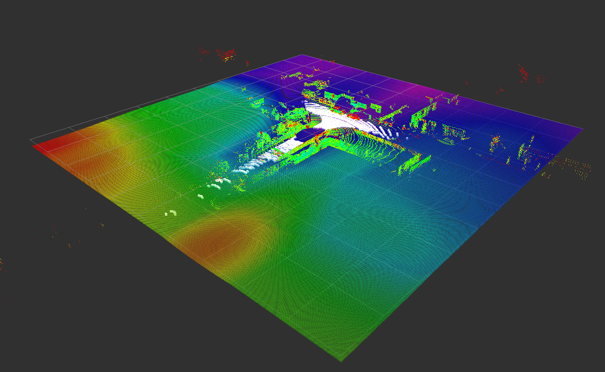

# 基于激光雷达点云重建地面

本项目测试基于位置编码器+MLP重建地面
本项目依赖ROS进行可视化

- 感觉速度很慢

## 效果展示

参考资料：
1. [RoMe: Towards Large Scale Road Surface Reconstruction via Mesh Representation](https://github.com/DRosemei/RoMe/)
2. [NeRO: Neural Road Surface Reconstruction](https://arxiv.org/pdf/2405.10554#page=14&zoom=100,180,594)

## demo
